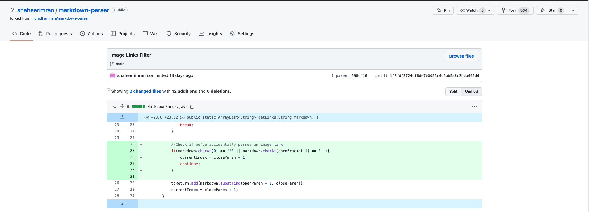
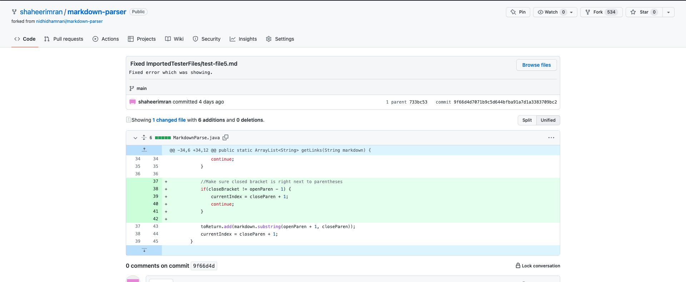
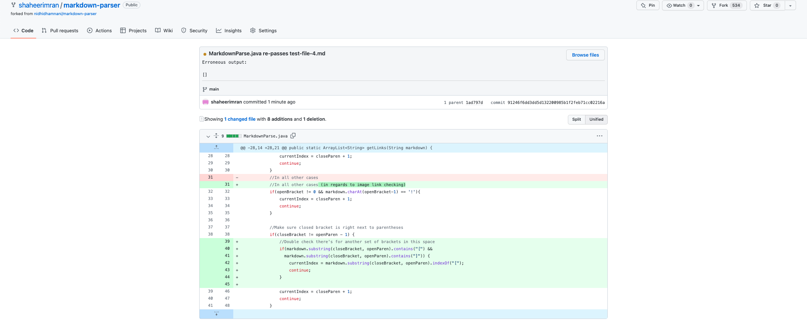

# Debugging Examples from MarkdownParse.java

## 1. Stopping code from accidentally including Image links
*Note: I didn't include the erroneous output in the original commit so I recreated it over here (sorry I didn't know at the time or I might've forgotten).

[Failure-Inducing Input](https://github.com/shaheerimran/markdown-parser/blob/main/test-file-3.md)

Erroneous output:
```
[https://www.google.com/search?q=China+landscape&tbm=isch&ved=2ahUKEwj07szd_pT3AhWSJX0KHaaqBP0Q2-cCegQIABAA&oq=China+landscape&gs_lcp=CgNpbWcQAzIFCAAQgAQyBQgAEIAEMgUIABCABDIFCAAQgAQyBQgAEIAEMgUIABCABDIFCAAQgAQyBQgAEIAEMgUIABCABDIFCAAQgAQ6BwgjEO8DECc6BwgAELEDEEM6BAgAEEM6CAgAEIAEELEDOgYIABAIEB5QmAJYnw1grA5oAXAAeACAAWqIAdkHkgEEMTEuMZgBAKABAaoBC2d3cy13aXotaW1nwAEB&sclient=img&ei=L9RYYrSbJJLL9AOm1ZLoDw&bih=744&biw=1440#imgrc=ruNm5bpbQ8gwlM, https://www.google.com/]
```

The bug causing this was erroneous output was the fact MarkdownParse.java didn't check to see if the character before openBracket was an '!' or not. The failure inducing input has the Image format specific '!' before one of the links and because the code at the time didn't check for it, erroenous output like the one shown above is produced.

## 2. Stop including invalid Markdown links with characters between brackets and parentheses
*Note: The commit included is a re-commit to fix one error and I accidentally forgot to include the erroneous output in this commit message when it was in the other

[Failure-Inducing input](https://github.com/shaheerimran/markdown-parser/blob/main/ImportedTesterFiles/test-file5.md)

Erroneous Output:
```
[page.com]
```
The failure-inducing input has an invalid link format in it where there's multiple lines and characters between closeBracket and openParen. The bug causing the symptom of the link showing in the output when it shouldn't is the lack of any verification that closeBracket is at the index right next to openParen.
## 3. Fixing the error where a link isn't included because there's a set of "[]" before a proper link format

[Failure-Inducing input](https://github.com/shaheerimran/markdown-parser/blob/main/test-file-4.md)

Erroneous output:
```
[]
```
Even though there's a link in the failure-inducing test file, MarkdownParse doens't show it in the output. This symptom is caused by a bug where MarkdownParse checks link formats to make sure there's nothing inbetween closeBracket and openParen but in doing so it didn't account for a situation of a set of brackets immediately followed by a proper link format with it's own brackets. The code associated the original set of brackets with the set of parentheses in the proper link format and because there was stuff between them (the brackets for the proper link), the code didn't include the link as it appeared to be from an invalid link format. 