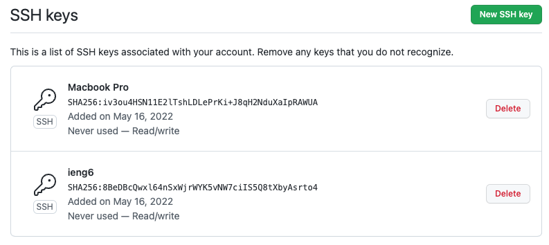

# Lab Report #3 - Week 6

## Streamlining ssh Configuration

In this group option, we learned how to set up aliases for ssh host/user combinations with a config file in our .ssh folder. This allows us to ssh/scp quicker than before as we can just write our chosen alias for the username/host combination instead of the whole user@host address.

## Setup Github Access from ieng6

This group option allows us to for the first time update our code and send new things to our GitHub repositories straight from ieng6. It's done through ssh key verification rather than the old username-password system.

## Copy whole directories with `scp -r`

This group option allows us to really speed up transferring files to the server as now we can transfer entire folders with one line. Combine this with other command line shortcuts we've learned and we can now transfer and remotely run files in just one line on the command shell.