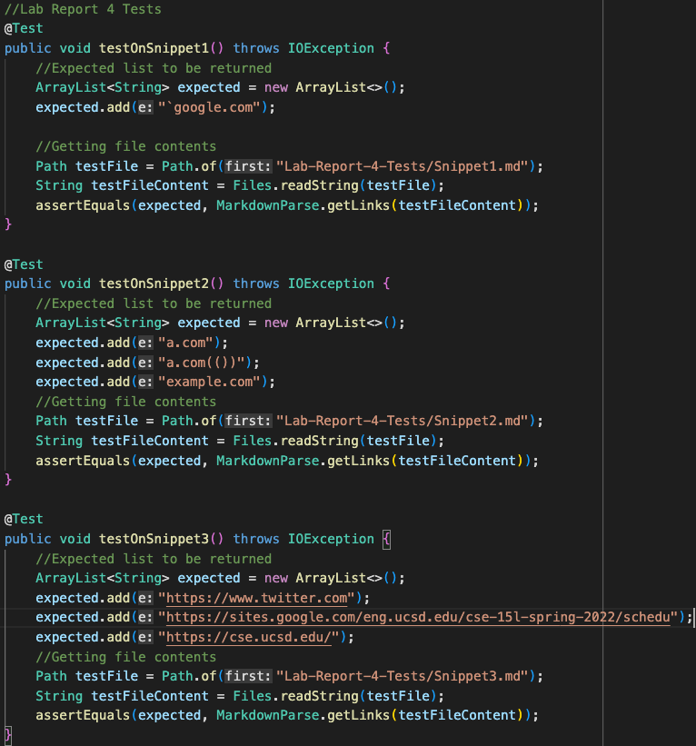

# Lab Report 4
By: Shaheer Imran

[My repository](https://github.com/shaheerimran/markdown-parser)

[Reviewed repository](https://github.com/szreik/markdown-parser)

## Correct Output for Each Snippet
Snippet 1:

Snippet 2:

Snippet 3:

## Adding Snippets as Tests in `MarkdownParseTest.java`

## Running Tests on Personal Implementation
Result: Failures for all 3 Snippets

## Running Tests on Reviewed Implementation
Result: Failures for all 3 Snippets (and more tests aside from those which previously passed)

- I think my version of MarkdownParse would require a code change larger than 10 lines in order to pass snippet 1 and all it's related cases because it would require monitoring for backticks but not inside parentheses. It would also have to ignore backticks inside incomplete brackets.

- I think my version of MarkdownParse would require a code change larger than 10 lines in order to pass snippet 2 and all it's related cases. It would require the monitoring of three distinct characters which interact with each other and in very confusing ways when nested: brackets, parentheses, and escaped brackets.

- I think my version of MarkdownParse could be updated to correctly Snippet 3 and related cases with an update of under 10 lines. It would simply have to check for new lines at the end of a seemingly good link and ignore any which don't have a parentheses on the line. This could be done with a few if-else blocks.